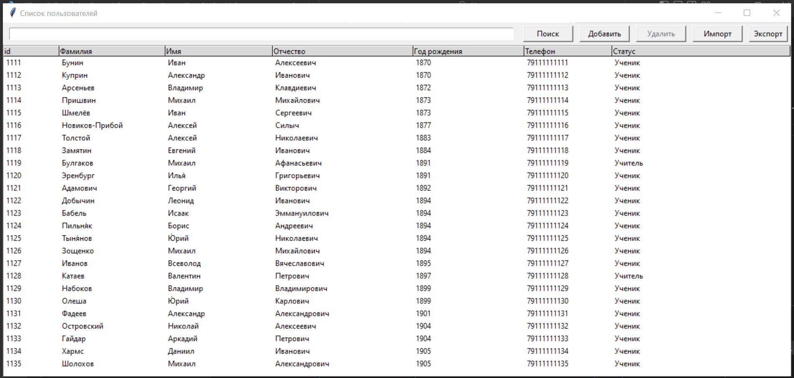
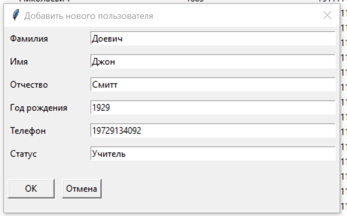
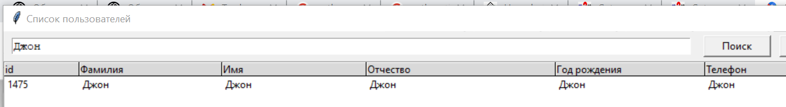
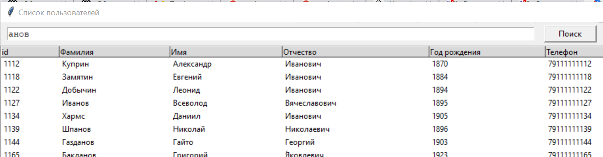
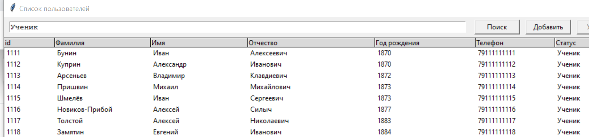
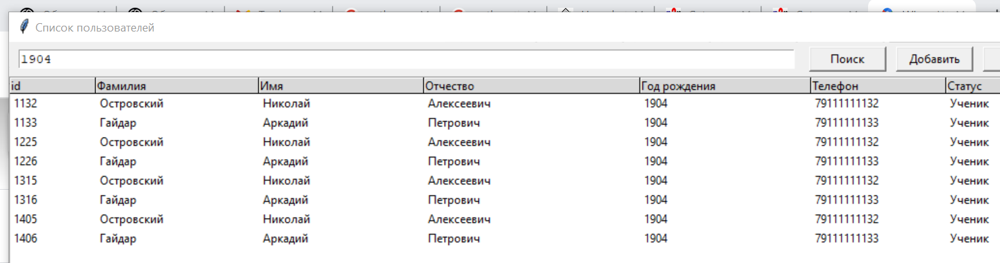
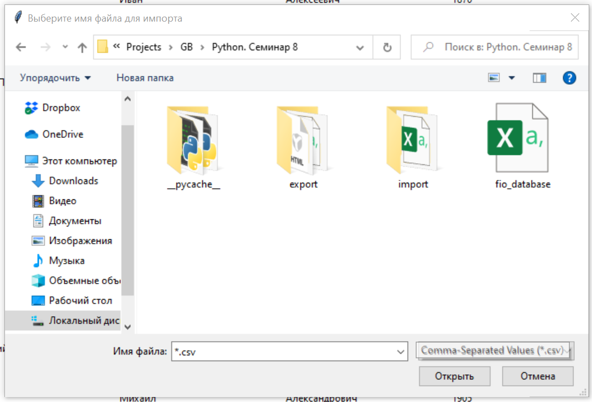
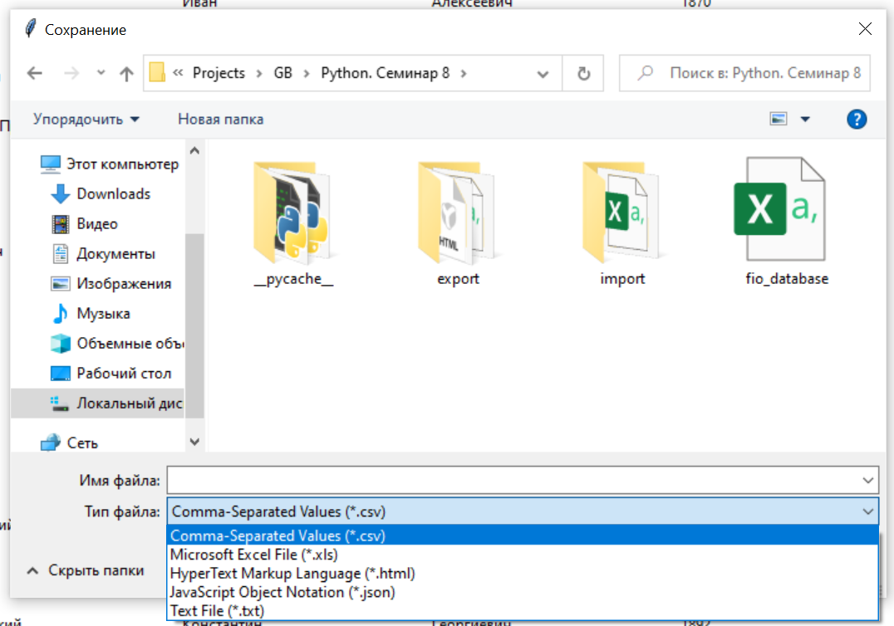

Простой справочник пользователей на Python с GUI, для произвольной базы данных в CSV, импортом из CSV, экспортом в 5 различных форматов, поиском и добавлением новых пользователей
=========================================

Справочник пользователей для произвольной базы данных в формате CSV. Названия полей для отображения и добавления берутся из заголовков CSV файла

Для добавления новых записей используется отдельный диалог. После добавления новой записи присваивается уникальный нормер, проверка на дубликаты данных не производится.

Поиск осуществляется по полному полю

Поиск осуществляется по части поля

Поиск осуществляется по любому полю

Независимо от формата и данных поля

Импорт осуществляется из CSV формата

Возможен экспорт в другие форматы

Файл базы данных "database.csv" хранится в текущей папке или в папке "files". Настройки находятся в модуле options.py.
