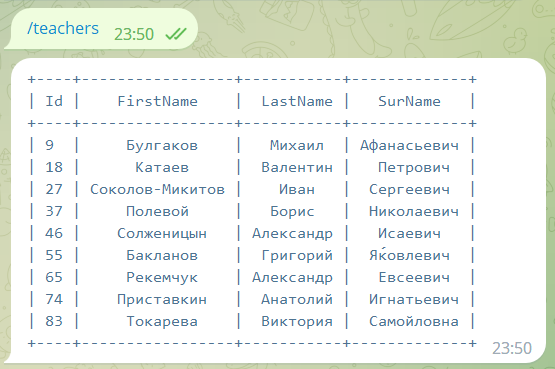

Простой bot-справочник на Python в telegram, с выводом данных и поиском
=========================================

Зайдя в телеграм бот [@py_sys42](https://t.me/py_sys42_bot), пользователь задает команды для отображения и поиска информации в справочнике учеников и учителей.

Поддерживаются следующие команды

Для более короткого вывода, вывод данных ограничен первыми 10 записями. 

Вывод данных учителей

Вывод данных учеников

Вывод данных по поисковому запросу

После поиска общей информации, можно запросить карточку пользователя по коду

В случае неправильных запросов выводятся пустые данные   

или

Для работы с данными используется база данных SQLite и ORM SQLAlchemy. Для табличного вывода используется prettytable.