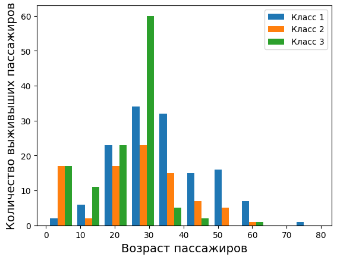
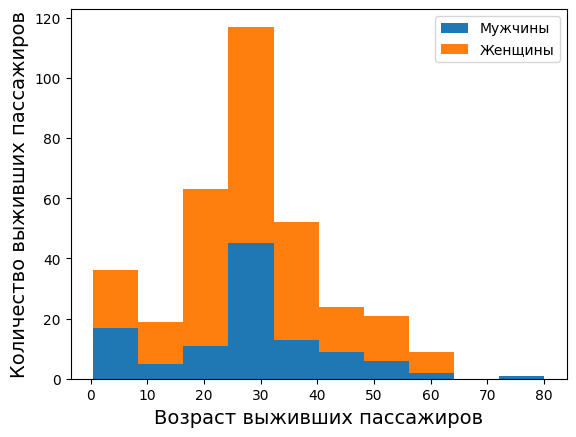

# Итоговый проект по python на специальности Программист
## Чтение и анализ данных из CSV файла с помощью jupiter

**Задание:**

Проанализировать любой датасет , который вам нравится (например, Титаник), найти интересные факты и зависимости, визуализировать результаты если получится.

**Что получилось:**

* Прочесть и вывести данные по пассажирам Титаника (titanic.csv)

* Заменить пустые значения возраста на средние значения

* Определить процент выживших

* Определить количество выживших, в зависимости от класса пассажира

* Рассортировать пассажиров по полу и определить, сколько из выживших - женщины, а сколько мужчины

### Возраст выживших пассажирова в зависимости от класса

### Возраст пассажирова в зависимости от пола

### Возраст выживших пассажирова в зависимости от пола

**Использованные модули:** pandas, numpy, matplotlib
