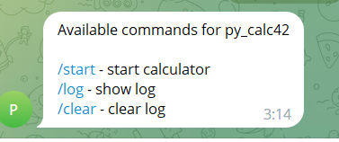
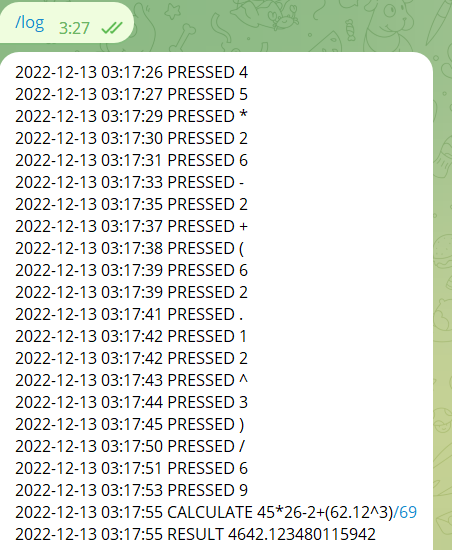

Простой bot-калькулятор на Python в telegram, логированием, плавающей точкой, скобками и без eval
=========================================

Зайдя в телеграм бот [@py_calc42](https://t.me/py_calc42_bot), пользователь кнопками задает данные для выражения. При нажатии кнопки "=" происходит вычисление введенного выражения.

Поддерживаются следующие команды

В случае ошибки в выражении, в поле ввода выводится надпись "ERROR"  

Калькулятор позволяет совершать следующие операции:

- \+ сложение
- \- вычитание
- \* умножение
- / деление
- ^ возведение в степень

Для десятичного разделителя вещественных чисел используется точка. Можно использовать скобки для указания приоритета операций.

В лог записываются действия пользователя, выражение и результат вычислений, старт и окончание работы программы. Вывести данные лог файла можно командой /log.

