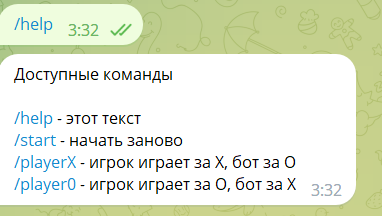

Простой bot крестики-нолики на Python в telegram
=========================================

Зайдя в телеграм бот [@py_ttt42](https://t.me/py_ttt42_bot), пользователь кнопками делает ход.

Поддерживаются следующие команды

В результате выигрыша, выводится сообщение о выигрыше, в результате ничьи - о ничье.