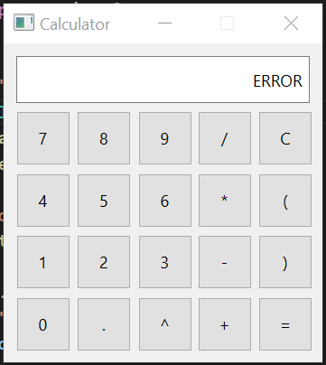
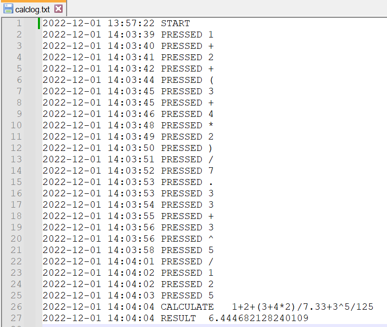
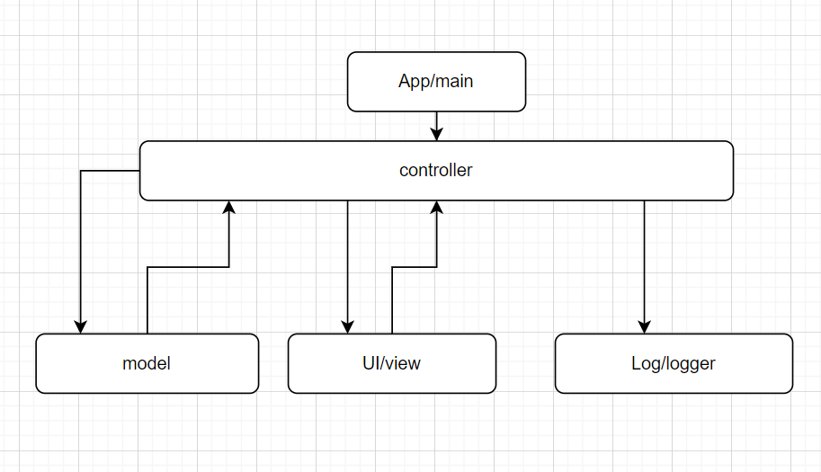

Простой калькулятор на Python с GUI, логированием, плавающей точкой, скобками и без eval
=========================================

С помощью мышки, используя графический интерфейс, пользователь задает данные для выражения. При нажатии кнопки "=" или клавиши "Enter" происходит вычисление введенного выражения.

В случае ошибки в выражении, в поле ввода выводится надпись "ERROR"  

Калькулятор позволяет совершать следующие операции:

- \+ сложение
- \- вычитание
- \* умножение
- / деление
- ^ возведение в степень

Для десятичного разделителя вещественных чисел используется точка. Можно использовать скобки для указания приоритета операций.

В лог файл "calclog.txt" записываются действия пользователя, выражение и результат вычислений, старт и окончание работы программы. Значения в лог файле разделяются табуляцией.

Схема работы программы

Программа построенна по паттерну MVC. Главный запускаемый модуль - main.py, в котором создается view для пользовательского интерфейса, model для вычисления выражения, controller для управления. В logger передаются данные для логирования.
